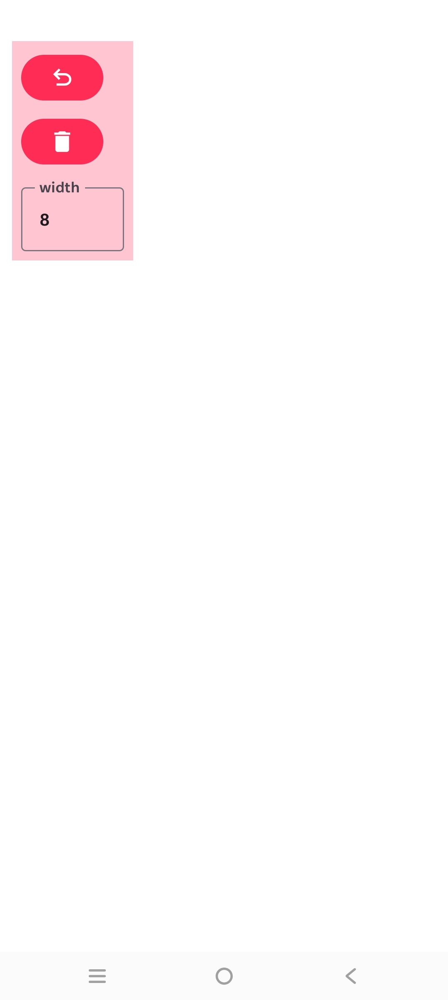

🎨 Drawing App

A simple and lightweight Drawing App built with Kotlin and Jetpack Compose for Android.

✨ Features

- 🖌️ Draw on a canvas
- ↩️ Undo drawing
- 🗑️ Delete / Clear drawing
- 📱 Simple and clean UI
- ⚡ Built with Jetpack Compose
- 🎨 Smooth touch drawing

🛠️ Technologies Used

- Kotlin
- Jetpack Compose
- Material 3
- Canvas
- Android Studio

📂 Project Structure

slate/
├── app/
│   └── src/
│       └── main/
│           ├── java/
│           └── res/
├── build.gradle.kts
└── README.md

🚀 How to Run

1. Clone this repository.
2. Open the project in Android Studio.
3. Wait for Gradle sync to finish.
4. Connect an Android device or start an emulator.
5. Click Run ▶.

🎯 Purpose

This project is created for learning and practicing:

- Jetpack Compose
- Canvas drawing
- Touch gestures
- State management
- Android UI development

📸 Add Your Screenshot

Place your screenshot in the repository, for example:

README.md
screenshot.png

Then README में:

📄 License

This project is available for learning and personal use.
